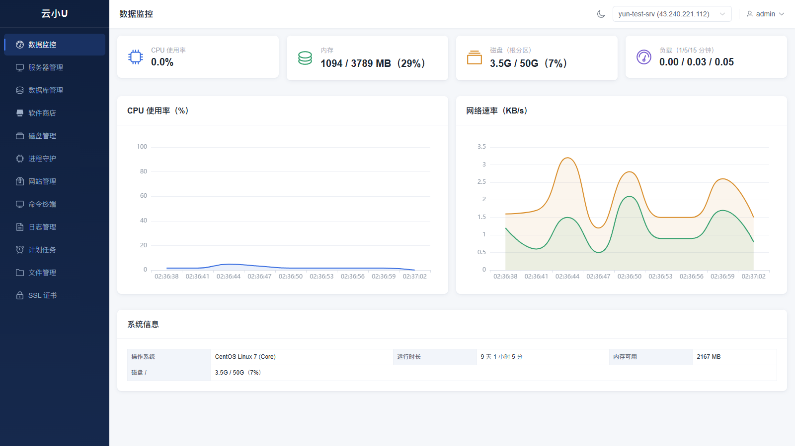
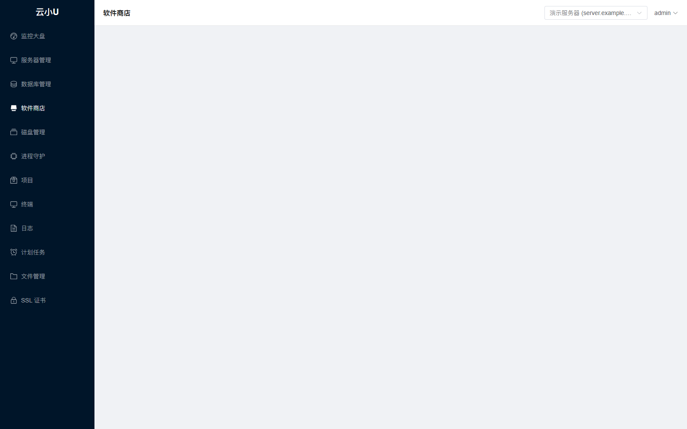
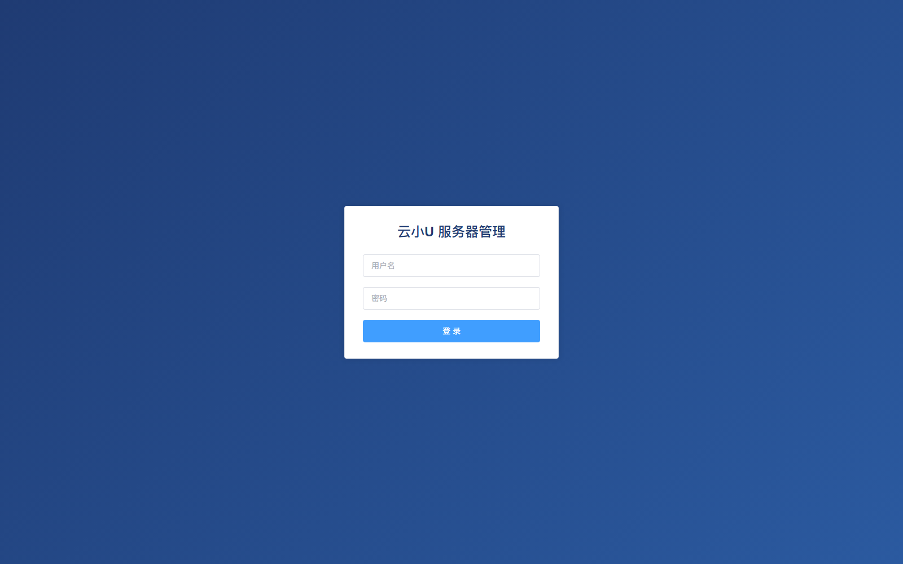

# 云小U — 服务器管理工具

通过 SSH 管理远程 Linux 服务器的 Web 面板。支持多服务器集中管理，覆盖监控、网站与项目、数据库、软件安装、文件、终端、计划任务、安全等完整运维场景。

## 界面预览

<p align="center">
  
  <br />
  <em>数据监控：CPU / 内存 / 磁盘 / 网络实时图表</em>
</p>

<p align="center">
  
  <br />
  <em>软件商店：多版本 PHP / Java / 常用软件一键安装与卸载</em>
</p>

<p align="center">
  
  <br />
  <em>登录页：城市背景品牌区 + 登录表单</em>
</p>

## 功能特性

| 模块 | 说明 |
|---|---|
| 📊 数据监控 | CPU / 内存 / 磁盘 / 网络 / 负载 / 系统信息实时图表（3 秒轮询） |
| 🖥️ 多服务器管理 | 服务器增删改查、SSH 连接测试、凭据 AES-256-GCM 加密存储 |
| 📦 软件商店 | Nginx / MySQL / Redis / Docker / Node / Python / Git / Fail2ban / Supervisor 等一键安装与**卸载**；**PHP 多版本**（7.4-8.3 并存、默认版本切换）；**Java 环境**（8/11/17 安装与切换）；Composer |
| 🗄️ 数据库管理 | MySQL 面板（Navicat 风格：库 → 表 → 结构 → 数据分页 → 执行 SQL；可视化创建/删除库表、字段增改删、行数据增改删，危险操作二次确认）；MySQL 多版本检测/安装/切换；Redis 状态与键管理 |
| 🌐 网站管理 | PHP（Nginx+php-fpm）/ Node / Python / Java 站点创建、systemd 服务管理、启停/重启/日志；**站点设置**：多域名、运行目录、伪静态（ThinkPHP/Laravel/WordPress 等预设，创建时可选）、默认文档、IP 黑白名单、密码访问、防盗链、重定向、反向代理、PHP 版本切换、SSL 关联、配置预览、网站日志 |
| 🐳 进程守护 | Supervisor 进程管理（创建配置、启停、删除） |
| 💾 磁盘管理 | lsblk / df 列表、分区挂载/卸载（危险路径保护） |
| 📁 文件管理 | 多文件/文件夹拖拽上传（SFTP）、拖拽移动、新建文件/文件夹、编辑、复制、重命名、权限、回收站删除、多标签页 |
| 🖥️ 终端 | 交互式 Web 终端（WebSocket + xterm.js） |
| 📜 日志 | 常用日志列表与实时 tail |
| ⏰ 计划任务 | 周期选择器（每分钟/小时/天/周/月），任务类型：Shell / URL GET / URL POST / Python 脚本 |
| 🔐 SSL 证书 | 项目域名下拉生成自签证书、上传证书、**自动续期**（剩余 30 天自动更新）、vhost 自动关联 443 |
| 🎨 界面 | 亮色/暗色模式切换、响应式布局（支持移动端）、修改密码 |

## 安全设计

- 🔑 JWT 认证 + 登录失败 5 次锁定 15 分钟
- 🔒 SSH 密码 AES-256-GCM 加密存储，主密钥来自环境变量 `MASTER_KEY`
- 🛡️ 危险命令黑名单拦截（`rm -rf /`、`mkfs`、`reboot`、`shutdown` 等）
- 📁 危险路径保护（`/etc/shadow`、`/etc/passwd`、`/root/.ssh` 等禁止读写）
- 🗑️ 删除操作走回收站（`/tmp/linuxmgr-trash/`），数据库删除前自动备份
- 🏷️ 所有新增配置统一 `linuxmgr-` 前缀，**不修改服务器任何已有配置**；Nginx 只用 reload 不重启
- 📋 全部写操作二次确认 + 审计日志（`data/audit.log`）
- ⚠️ 无 WHERE 的 DELETE/UPDATE、`curl | bash` 等危险操作被拦截
- 🔐 支持在线修改管理员密码（scrypt 加盐哈希存储于 `data/auth.json`；已签发的 JWT 在 24h 有效期内仍然可用）

## 技术架构

```
┌─────────────┐      REST / WebSocket       ┌──────────────────┐      SSH / SFTP       ┌─────────────┐
│  Vue 3 前端  │ ──────────────────────────▶ │   Express 后端    │ ───────────────────▶ │  Linux 服务器 │
│ Element Plus │ ◀────────────────────────── │  SSH 长连接池     │ ◀─────────────────── │  多台可管理  │
│  xterm.js    │        JWT 认证             │  JWT / AES-256   │                      │             │
└─────────────┘                             └──────────────────┘                      └─────────────┘
```

- **后端**：Node.js + Express，SSH 长连接池（自动重连 / 空闲回收 / 并发队列），JWT 认证，本地 JSON 存储（原子写入）
- **前端**：Vue 3 + Vite + TypeScript + Element Plus + Pinia + ECharts + xterm.js（参照 vue3-element-admin 布局风格）
- **认证**：JWT（24h 过期），单管理员

## 快速开始

```bash
# 1. 后端
cd server
npm install
cp .env.example .env   # 填写 JWT_SECRET / MASTER_KEY / ADMIN_USER / ADMIN_PASSWORD
npm start              # http://localhost:3000

# 2. 前端（开发模式）
cd apps/web
npm install
npm run dev            # http://localhost:5173，/api 代理到 3000

# 3. 生产部署：前端构建后由后端单端口托管
cd apps/web && npm run build
```

首次使用：浏览器打开 `http://localhost:5173`，使用默认账号 `admin`、默认密码 `123456` 登录（`.env` 中 `ADMIN_PASSWORD` 显式设置时以 `.env` 为准），然后在「服务器管理」中添加你的 Linux 服务器（root 或 sudo 用户），即可开始管理。

## 目录结构

```
├── server/                  # Express 后端
│   ├── src/
│   │   ├── routes/          # auth / servers / monitor / database / store / projects /
│   │   │                    # supervisor / disk / files / ssl / logs / crontab / terminal
│   │   ├── ssh/             # 长连接池、命令执行（危险命令黑名单）
│   │   ├── crypto/          # AES-256-GCM
│   │   ├── auth/            # JWT
│   │   ├── utils/           # 输出解析器、审计日志、发行版检测
│   │   └── index.js
│   └── test/                # Node 内置 test runner（138+ 测试）
├── apps/web/                # Vue 3 前端
│   └── src/views/           # dashboard / servers / databases / store / projects /
│                            # supervisor / disk / files / ssl / logs / crontab / terminal
└── docs/                    # 设计文档、实现计划、图片
```

## 加入交流群

QQ 群：**812548199**（易语言 · Java · 网站技术交流）

<p align="center">
  
</p>

或点击链接直接加群：[https://qm.qq.com/q/TuZ9dWR3ys](https://qm.qq.com/q/TuZ9dWR3ys)

## 免责声明

本工具面向有服务器管理基础的用户，请在测试环境先行验证；对生产服务器的操作请自行评估风险。项目不承担因使用本工具造成的任何损失。
